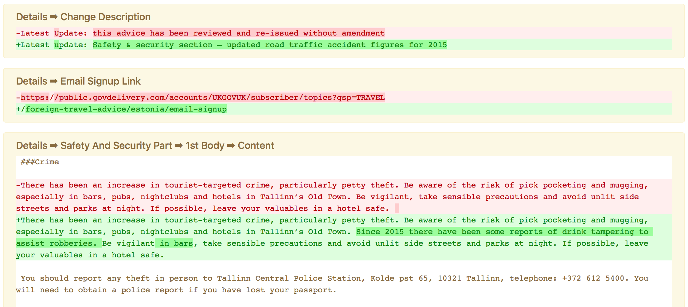
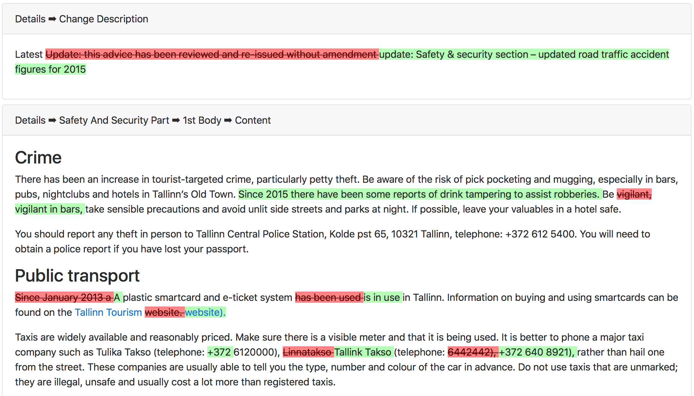

# GOV.UK Content Diff Prototypes

## Background

The objective is to build a number of prototypes which can be used to show diffs between different versions of content items.

The prototypes are split into two types of views: technical and non-technical.

## Findings

The process of finding the difference between editions is not a trivial task. Although you can find a reasonable system for the majority of editions, there will always be little things you can do here and there to make specific kinds of editions have more useable diffs.

### What's actually changed?

The first thing to do is to figure out what fields in the edition have changed. You can start by using the `best_diff` method from the [HashDiff][hashdiff] library which gives you a list of differences between two hashes. We found a few limitations with this approach which we were able to workaround by doing some post-processing.

There are three kinds of differences reported by [HashDiff][hashdiff]: additions, deletions and modifications. We noticed that sometimes the library would give us a deletion and an addition for the same field when really this should just be a single modification. This tended to happen when dealing with arrays, so whether or not this is expected behaviour is unknown, but it did lead to confusing diffs. To fix this, we simply collapsed additions and deletions on the same field into a single modification:

```ruby
['-', 'thing', 'a']
['+', 'thing', 'b']
```

```ruby
['~', 'thing', 'a', 'b']
```

We also found that when a large hash with multiple fields was added in one go to an edition, the library would report this as a single addition. This seems like reasonable behaviour for the library, but showing an entire hash to users is not very friendly. We decided to include a process which would recursively expand those differences into multiples, as shown below for example:

```ruby
['+', 'thing', {a: 'b', c: 'd'}]
```

```ruby
['+', 'thing.a', 'b']
['+', 'thing.c', 'd']
```

At this point we have a reasonably clear diff showing what fields have changed within an edition.

### What's a details hash?

The field names used in editions are conveniently written in reasonably plain English making them easy to understand. However, they are all in lowercase, they use underscores instead of spaces, `.` to go deeper into a hash and `[x]` to access an index in an array. These make them seem scary and technical therefore putting people off.

We came up with a simple algorithm for turning a fully qualified field name into a more readable one which seems to work well in the majority of cases.

- Rather than splitting the parts of a fully qualified field by a `.` use something more meaningful like a ` ➡ `.
- Replace uses of `[x]` so the number appears at the beginning with an ordinal, for example, `part[0]` would turn into `1st part`. If possible, it's good to also singularise the field here.
- Replace underscores with spaces.
- Capitalise the first letter of each word in the field.
- Use the titles of edition parts instead of the number. There is a common practice of editions have an array of parts and each part containing a title and a body, when referencing a particular part it is possible to therefore find its title.

As well as the steps above, there are a number of special cases to deal with like `Url` and `URL`.

Some examples of using this algorithm are:

| Original | Replacement |
| - | - |
| `details.change_description`  | Details ➡ Change Description  |
| `details.parts[2].body[0].content`  | Details ➡ Safety And Security Part ➡ 1st Body ➡ Content  |
| `public_updated_at`  | Public Updated At  |

### What's different?

So far the techniques detailed above provide value to both technical and non-technical diffs, but now it is useful to make the distinction to provide a useful view for the two kinds of audience.

#### Technical

A technical user is defined as someone who is used things like lines, line numbers, govspeak and files and is comfortable with a GitHub code style change view.

To provide for this kind of user, we found that a library called [Diffy][diffy] would give us everything that we needed. We are able to get both an inline and a side by side view by simply using the library and including its CSS.




#### Non-technical

A non-technical user is defined as someone who doesn't want to have parts of the system revealed to them and is more comfortable with a Microsoft Word style change view.

This is a more complicated problem to solve. We first found that there was [a service provided by W3C][w3c-htmldiff] which allows you to do a diff between HTML files, and the code that powered it was available for free. We used that code as basis for the HTML diff we wanted to include in the prototypes.

Before we could use the diff we had to find a way of knowing which fields are HTML. We achieved this by creating a [blacklist of fields][field-blacklist] which are not relevant to technical users and then running every other field through Govspeak. This works because HTML will be left alone by Govspeak, and Govspeak itself will be turned into HTML.

Finally, just as a proof of concept more than anything else, we identified that the `details.image.url` field would always contain a URL to an image, so we wrapped this around an `` tag before presenting it to the user. This sort of thing could be extended in the future to work with many other types of fields — but again, each new field supported will only be useful to a minority of editions, so there is a tradeoff to be had there.




## Comments

Here are some comments from presenting the prototype to the team:

- it just works
- the diff is fairly self-explanatory about what's changed
- separation of fields means it's flexible (I think)

## Importing Data

```ruby
document_types = Edition.pluck(:document_type).uniq.sort
document_types.reject! { |d| d.start_with?("placeholder_") }
document_types.reject! { |d| d == "travel_advice_index" }
document_types.reject! { |d| d == "mainstream_browse_page" }
documents = document_types.map { |document_type| Edition.where(document_type: document_type, user_facing_version: 1).order('RANDOM()').limit(10).map(&:document).uniq }
documents.each { |docs| docs.each { |doc| doc.editions.order(user_facing_version: :asc).each_with_index { |edition, edition_index| json = Presenters::EditionPresenter.new(edition, draft: edition.draft?).for_content_store(0).to_json; dir = "data/#{doc.editions.first.document_type}/#{doc.content_id}"; FileUtils::mkdir_p(dir); File.write("#{dir}/#{edition_index}.json", json); nil } } }
```

[hashdiff]: https://github.com/liufengyun/hashdiff
[diffy]: https://github.com/samg/diffy
[w3c-htmldiff]: http://services.w3.org/htmldiff
[field-blacklist]: https://github.com/thomasleese/govuk-content-diff-prototypes/blob/master/lib/combined_diff.rb#L34
